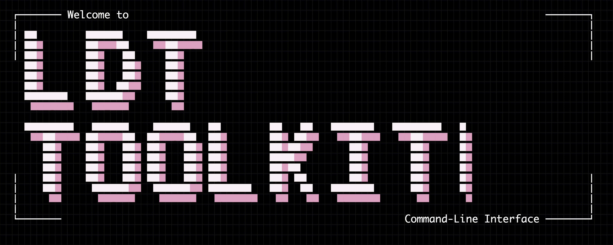

<div align="center">
  
</div>

<p align="center"><big><big><strong>L</strong>ongitudinal <strong>D</strong>epression <strong>T</strong>rajectories <em>CLI</em></big></big></p>

<div align="center">
  
  
  
  
  
</div>

<div align="center">
  <a href="https://github.com/Longitudinal-Depression-Toolkit/ldt-toolkit">Primary end-user repository: ldt-toolkit</a> -
  <a href="https://life-epi-psych.github.io">LEAP Group</a>
</div>

##  About The Project

The `Longitudinal Depression Trajectories Toolkit (LDT-Toolkit)` initiative is designed for social, medical, and clinical researchers who work with repeated-measure data and need a stepping-stone path from raw cohort files to downstream modelling.

The initiative delivers two interconnected components. First, `ldt-toolkit` is the Python engine of tools and reproducible pipelines to accelerate exploration of longitudinal studies towards downstream modelling. Second, `ldt` (this repository) is a fully interactive Go CLI with a no-code terminal interface for running and orchestrating the toolkit from start to finish.

The toolset supports two broad lines of exploration. `Playground` methods help researchers iterate quickly on datasets across data preparation, data preprocessing, and machine learning phases. `Presets` provide stage-level reproducible pipelines for specific studies and are built to grow through community contributions.

This current repository is the CLI component of the project. For the full end-to-end toolkit experience, workflows, and primary documentation, use [`ldt-toolkit`](https://github.com/Longitudinal-Depression-Toolkit/ldt-toolkit).

##  Setup & Launch

###  Homebrew

```bash
brew tap Longitudinal-Depression-Toolkit/homebrew-tap
brew install ldt
```

###  Scoop Bucket

```powershell
scoop bucket add longitudinal-depression-toolkit https://github.com/Longitudinal-Depression-Toolkit/scoop-bucket
scoop install ldt
```

###  From Source

```bash
git clone https://github.com/Longitudinal-Depression-Toolkit/CLI.git
cd CLI
make build
```

###  Launch It Anywhere

Homebrew and Scoop put `ldt` on `PATH` automatically.

If you built from source, run the installer target for your shell:

```bash
# bash
make install-bash

# fish
make install-fish
```

Now run from any directory:

```bash
ldt
```

##  Novel Command Palette

We've made sure the UX of the CLI stays smooth at every moment. Use the command palette wherever you are to instantly launch any tool or preset of your choice, without walking through each menu level by hand.

In practice, launch `ldt`, open the palette with `:` or `Ctrl+P`, type a phrase like `build trajectories`, and press `Enter` to run it. While typing, `Tab` auto-completes, `Ctrl+H` opens history, `Ctrl+L` clears input, and `Esc` closes the palette.

##  What's Next?

Jump to the main repository for toolkit documentation, workflows, and end-user guidance:

- [`ldt-toolkit`](https://github.com/Longitudinal-Depression-Toolkit/ldt-toolkit)

##  Security

Please do not share participant-level or restricted data in issues or pull requests.

Security policy and contact details:
- [`SECURITY.md`](SECURITY.md)

_Special thanks to [@charm.land](https://charm.land) for their amazing TUI framework!_